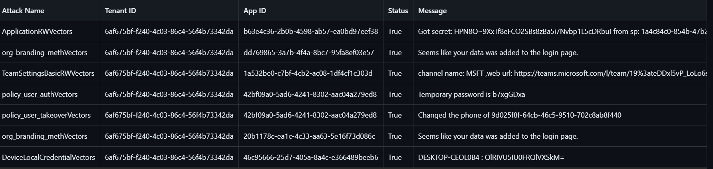

<!-- START doctoc generated TOC please keep comment here to allow auto update -->
<!-- DON'T EDIT THIS SECTION, INSTEAD RE-RUN doctoc TO UPDATE -->

# Table Of Contents

- [Introduction](#introduction)
- [Features](#features)
- [Feedback](#feedback)
- [Contributors](#contributors)
- [Acknowledgments](#acknowledgments)

<!-- END doctoc generated TOC please keep comment here to allow auto update -->

## Introduction


This Tool is based on Adi Malyanker's research on application permissions in Entra ID. The tool implements more than 40 attack vectors found in the research. Pay attention that small amount of the attack vectors were found by other researchers (2-4 attacks). 

## Features

Permission you can exploit with PermissionPanic (some permissions got a couple of attack vectors):

* Application.Read.All + AppRoleAssignment.ReadWrite.All 
  
* Application.ReadWrite.All 

* AdministrativeUnit.ReadWrite.All 

* Policy.ReadWrite.ConditionalAccess

* Policy.ReadWrite.CrossTenantAccess

* Directory.ReadWrite.All

* EntitlementManagement.ReadWrite.All

* RoleManagement.ReadWrite.Exchange

* PrivilegedAssignmentSchedule.ReadWrite.AzureADGroup

* DeviceLocalCredential.Read.All

* LifecycleWorkflows.ReadWrite.All

* Mail.Send + Mail.ReadBasic

* MailboxSettings.ReadWrite

* MultiTenantOrganization.ReadWrite.All

* DelegatedPermissionGrant.ReadWrite.All

* Organization.ReadWrite.All

* UserAuthenticationMethod.ReadWrite.All

* RoleAssignmentSchedule.ReadWrite.Directory

* Policy.ReadWrite.SecurityDefaults

* TeamMember.ReadWrite.All

* TeamSettings.ReadWrite.All

* User.EnableDisableAccount.All

* User.Invite.All

* User.ReadWrite.All

## Usage 
Create a configurations file accroding to the next section.
Run in the following way:

```
creating a csv file:
Python PermissionPanic.py -o csv -f conf.json

creating a json file:
Python PermissionPanic.py -o json -f conf.json
```


## configuration file (check out the attached config file)
```
{
    "logLevel": <logging level, for example INFO>, 
    "tenants": [
        {
            "tenantId": <tenant id>,
            "applications": [
                {
                    <application id>: <application's secret>
                },
                {
                    <application id>: <application's secret>
                }
            ]
        },   
    ],
    "ApplicationReadWriteAll": {
        "sp": [
            <object id in application registration>
        ],
        "dn": <dn of secret's name>,
        "attacker": [
            < obj id of attacker to  be owner>
        ],
        "addOwnerToEA": [
            <object id of enterprise app>
        ],
        "addOwnerToSP": [
            <object id of sp>
        ]
    },
    "UserReadWriteAll": {
        "users": [
            <user object id>
        ]
    },
    "UserInvite": {
        "users": [
            <user's mail to be invited>
        ]
    },
    "UserEnDis": {
        "users": [
            <user obj id to be deleted>
        ]
    },
    "administrativeUnits": {
        "AU": [
            <object id of au>
        ],
        "users": [
           <object id of users to add>
        ]
    },
    "organization": {
        "orgID": <tenant id>,
        "urlPrivacy": <can be null.  A custom URL to replace the default URL of the "Terms of Use" hyperlink in the footer>,
        "TermsUrl": <can be null. A custom URL to replace the default URL of the "Terms of Use" hyperlink in the footer>,
        "resetUrl": <can be null. A custom URL for resetting account credentials>
    },
    "roleManagement": {
        "roleUpdateId": <if we want to update the role id>,
        "permissions": [
            <permissions to be added to the new role. we can get from https://learn.microsoft.com/en-us/entra/identity/role-based-access-control/permissions-reference>
        ],
        "newRoleName": <new role name>,
        "newRoleDesc": <description of new role>,
        "user": <user to be be upgraded to new role>,
        "roleId": <the new role. we can get it from https://learn.microsoft.com/en-us/entra/identity/role-based-access-control/permissions-reference>
    },
    "TeamSettings": {
        "teamNames": [<id of teams. can be achieved by https://graph.microsoft.com/beta/teams. can be [] and then we show all links.>]
    },
    "TeamsMemSettings": {
        "teamNames": [
            <role to be added>
        ],
        "users": [
            <user to be granted>
        ]
    },
    "RoleSchedule": {
        "roleDefinitionId": "9b895d92-2cwd-44c7-qd02-a6ac2d5ea5c3",
        "principalId": "0de0c503-709d-4qw0-9q1d-8d9279fcd7b2"
    },
    "mailSend": {
        "victims": [
            <where to sniff packets>
        ],
        "attacker": <to who send the packets>
    },
    "mailbox": {
        "title": <title of phishing mail>,
        "victim": <on whom to put the automatic reply>,
        "message": <malicious mail content>,
        "attacker": <where to send the packets>,
        "readingVictim": <where to set the rule>
    },
    "Gpim": {
        "principal": <who to add this group>,
        "groupId": <where to add to>
    },
    "exchange": {
        "princpalId": <group from exchange admin>,
        "roleId": <role to be added>
    },
    "Entitlement": {
        "resourceId": <object id of the group (?) maybe we can get it by graph api>,
        "CatalogResourceName": <group we want to add the user to from the catalog>,
        "userId": <object id of user to be updated or mail of external user in case it is external>,
        "isExternalUser": <is the user to be added an external user?>
    },
    "lifecycle": {
        "userCC": <object id of user to get more mail of tap>,
        "victim": <user to be disable and tap>,
        "groupId": <group id>,
        "attacker": <user to be  added to group>
    },
    "UserPolicyAuth": {
        "UserId": <user id>,
        "phone": <attacker phone number>
    },
    "OrgAuthMeth": {
        "cert_file": <root ca cert path>,
        "groupId": <group to be added>
    },
    "oauthDeleg": {
        "permission": <permissions to be added>,
        "ResourceId": <obj id of microsoft graph>,
        "clientId": <object id of app  that gets the permissions (from enterprise apps)>
    },
    "conditional_access": {
        "users": <obj id of user>
    },
    "appAssignment": {
        "roleId": <id of role>,
        "ResourceId": <graph obj id>,
        "clientId": <obj id of the app to get the permissions>
    },
    "crossTenant": {
        "tenantId": <attacker tenant id>
    },
    "multiTenant": {
        "tenantId": <multi tenant owner's obj id ( the attacker tenant id)>
    }
}
```
## output example
[output](https://github.com/maladi17/PermissionPanic/blob/main/output.csv)



## Feedback

Feel free to send us feedback on <some contact way> or open an issue. Feature requests are always welcome. If you wish to contribute, please contact us.

## Contributors

* Adi Malyanker - A security researcher in Semperis. Made the research and developed the tool's indicators.
* Shay Reuven - A security architect in Bank Leumi. Developed the tool's infrastructure.

## Acknowledgments

Thanks to [Semperis](https://www.semperis.com/) for supporting this research.
